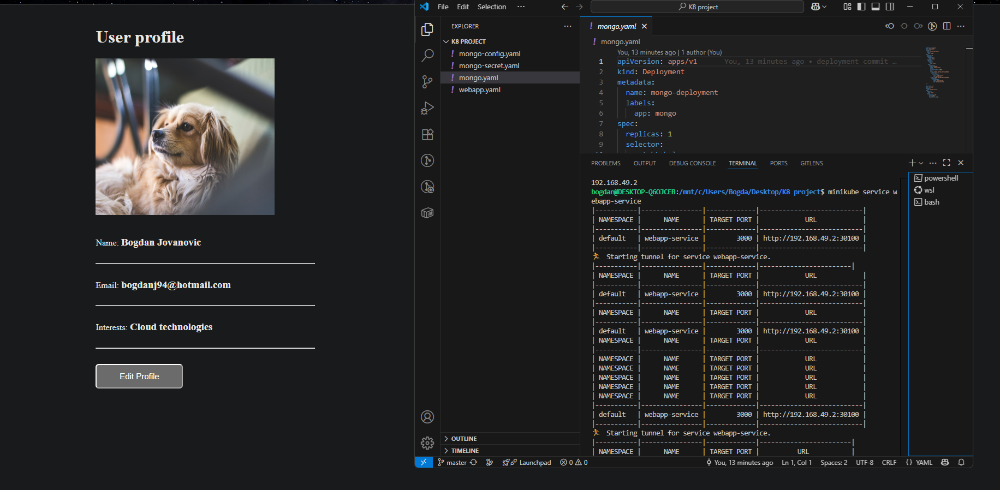

This project contains a simple full-stack application deployed on a local Kubernetes cluster using Minikube. It includes:

- A Node.js web application(in docker container)

- A MongoDB database

- Kubernetes Deployments, Services, and Secrets

- Connection between webapp and MongoDB using environment variables

This web application is connected to the MongoDB database, so when you open the app URL, you can view and update data dynamically. Any changes made through the UI are saved directly in the database.



## 🚀 How to Run Locally (Minikube)

```bash
# Start Minikube
minikube start

# Apply secrets and config for MongoDB
kubectl apply -f mongo-secret.yaml
kubectl apply -f mongo-config.yaml

# Deploy MongoDB and WebApp
kubectl apply -f mongo.yaml
kubectl apply -f webapp.yaml

# Get Minikube IP
minikube ip
# If using WSL on windows:
minikube service webapp-service

# Access the web application in your browser:
# http://<minikube-ip>:<nodePort> 
